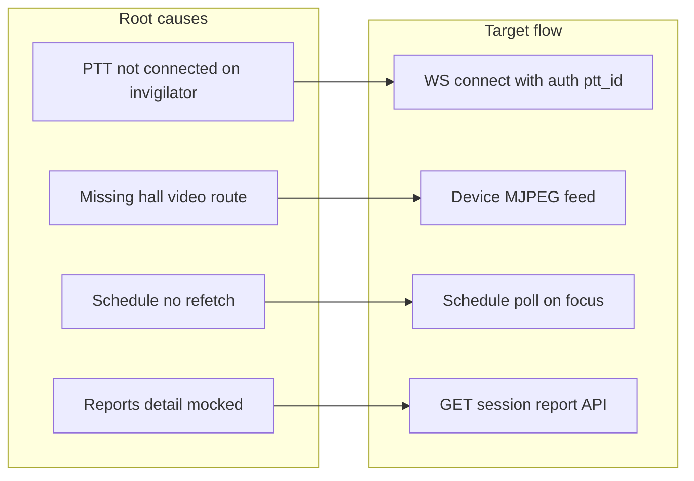
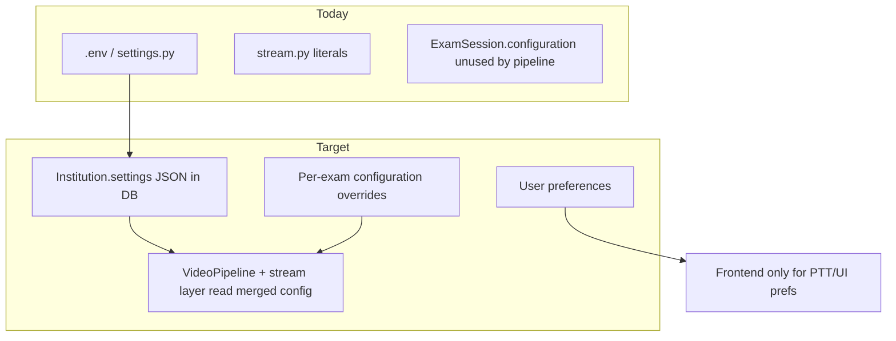

# Invigilator Dashboard & Admin Reports/Settings Plan

## Current state (what’s broken or missing)

| Area | Status |
|------|--------|
| **PTT** | WebSocket PCM works in backend ([`src/thaqib/api/routes/ptt.py`](src/thaqib/api/routes/ptt.py)), but invigilator UI never calls `connect()`, uses hardcoded demo IDs, and invigilator transmits to wrong target — explains no audio PC ↔ mobile |
| **Invigilator hall page** | Status API is correct; UI polls every 5s ([`HallMonitoringPage.tsx`](frontend/src/pages/invigilator/HallMonitoringPage.tsx)), but live video uses **non-existent** `GET /api/stream/hall/{hallId}/video` |
| **Invigilator schedule** | Loads `/api/sessions/my` **once** ([`SchedulePage.tsx`](frontend/src/pages/invigilator/SchedulePage.tsx)) — stale after admin starts exam or after leaving hall detail |
| **Admin Exams tab** | Start works via modal; cards ignore `exam.status` / per-hall monitoring; no stop control ([`ExamsTab.tsx`](frontend/src/components/ExamsTab.tsx)) |
| **Admin Reports** | List + event counts are real; detail body and download are **hardcoded** ([`ReportsTab.tsx`](frontend/src/components/ReportsTab.tsx)) |
| **Settings (both roles)** | Admin gear = logout; invigilator route = “قريباً” ([`App.tsx`](frontend/src/App.tsx), [`DashboardPage.tsx`](frontend/src/pages/DashboardPage.tsx)) |

---

## Phase 1 — Critical fixes (PTT + exam state sync)

### 1A. Fix PTT end-to-end

**Root causes** in [`useInvigilatorPtt.ts`](frontend/src/hooks/useInvigilatorPtt.ts):

- Defaults: `clientId = control_room_dashboard`, `defaultTargetId = invigilator_demo_1` (wrong for invigilator uplink)
- Invigilator pages never call `connect()` (admin [`DashboardPage.tsx`](frontend/src/pages/DashboardPage.tsx) does via `ensurePttConnected`)

**Implementation:**

1. Create `PttProvider` (or extend hook) that on mount:
   - Fetches `GET /api/auth/me` for `ptt_id` and `role`
   - **Admin/referee:** `defaultTargetId` = selected invigilator’s `ptt_id` (from assignment/alert context)
   - **Invigilator:** `defaultTargetId` = `control_room_1` or a dedicated `control_room` user from seed/config
   - Calls `connect()` automatically when entering invigilator layout or dashboard
2. Append JWT to WS URL when cookies may not cross hosts: `pttWebSocketUrl(id) + '?access_token=' + token` ([`api.ts`](frontend/src/config/api.ts) — backend already supports query param in `ptt.py`)
3. For mobile testing: document `VITE_WS_ORIGIN` / access via same host as API (e.g. `http://<LAN-IP>:5173` with Vite proxy, or production build)
4. Admin “contact invigilator” on alert cards: pass that hall’s **primary** assignment `ptt_id` as target (requires `ptt_id` on user list API or enriched assignments)
5. UI: connection badge on [`PttPage.tsx`](frontend/src/pages/invigilator/PttPage.tsx) and hall floating mic (connected / transmitting / error)

**Acceptance:** Hold PTT on admin PC → audio on invigilator phone; hold PTT on invigilator → audio on admin PC (demo users `control_room_1` ↔ `invigilator_demo_1` after seed).

### 1B. Fix invigilator exam page not reflecting “running”

Two separate fixes:

| Symptom | Fix |
|---------|-----|
| Schedule still shows “مجدول” after exam started | Refetch `/api/sessions/my` on: route focus (`useLocation` + refetch), interval (30s), and when navigating back from hall detail |
| Hall detail shows “متوقف” while monitoring is active | Verify status poll (already 5s); add **immediate refetch** after `monitoring/start` success; on mount, if `location.state` or query hints admin-started, refetch once |
| User thinks monitoring didn’t start (black video) | Fix video feed (1C) — broken stream looks like “not running” |

**Files:** [`SchedulePage.tsx`](frontend/src/pages/invigilator/SchedulePage.tsx), [`HallMonitoringPage.tsx`](frontend/src/pages/invigilator/HallMonitoringPage.tsx), optionally shared `useAssignments()` hook.

### 1C. Invigilator live video

- Add invigilator permission to view streams OR add hall-level aggregator endpoint
- **Preferred (minimal):** `GET /api/sessions/{sessionId}/halls/{hallId}/feeds` returning camera `device_id`s; UI renders first camera via existing `GET /api/stream/feed/{device_id}` with `require_stream_user` extended to `invigilator` for assigned halls only ([`stream.py`](src/thaqib/api/routes/stream.py))
- Update [`HallMonitoringPage.tsx`](frontend/src/pages/invigilator/HallMonitoringPage.tsx) to use real feed URL(s), not `/api/stream/hall/.../video`

### 1D. Backend monitoring edge case (small)

In [`start_hall_monitoring`](src/thaqib/api/routes/stream.py): on start, **clear `monitoring_ended_at`** so re-start after stop works; reject start if already active (optional guard).

---

## Phase 2 — Admin Exams tab: running state + stop

**Goal:** When any hall in a session is monitoring, the exam card shows **جاري** and offers **إيقاف الامتحان**.

**Data model (already exists):**

- Session: `ExamSession.status` (`scheduled` | `active` | `completed`)
- Per hall: `Assignment.monitoring_started_at` / `monitoring_ended_at`

**UI changes in [`ExamsTab.tsx`](frontend/src/components/ExamsTab.tsx):**

1. **ExamCard** — show status chip:
   - `active` or any assignment with `started && !ended` → green “جاري الآن”
   - `completed` → gray “منتهي”
   - else → “مجدول”
2. **Per-hall breakdown** (compact): “قاعة 101: مباشر / متوقف” from `exam.assignments` (ensure `GET /api/sessions/` returns `monitoring_*` on assignments — extend [`ExamSessionResponse`](src/thaqib/schemas/exams.py) if missing)
3. **Actions when running:**
   - Replace or supplement “بدء الامتحان” with **إيقاف الامتحان** → confirm modal → `POST .../monitoring/stop` for **each active hall**
   - Keep “بدء الامتحان” for scheduled/partial starts
4. **Polling:** refresh exam list every 10–15s while Exams tab is open (or after modal close)

**Acceptance:** Admin starts hall from modal → card updates to running without full page reload; stop ends all halls and card returns to scheduled/completed.

---

## Phase 3 — Admin Reports (replace mocks, SRS FR-11)

**Scope:** Admin-only (per your choice). No invigilator reports tab.

### Reports page structure

**A. List view** (enhance existing [`ReportsTab.tsx`](frontend/src/components/ReportsTab.tsx)):

- Filter: status (`completed` / `active` / `scheduled`), date range, search by exam name
- Card metrics (real): total detection events, high-severity count, halls count, monitoring duration, session status
- Empty/loading states

**B. Detail view** (replace hardcoded prose ~lines 166–176):

| Section | Content (from APIs) |
|---------|---------------------|
| Header | Exam name, type, date, status, assigned halls, invigilators |
| Summary KPIs | Total alerts, events by severity, monitoring uptime (earliest `monitoring_started_at` → latest `monitoring_ended_at`) |
| Per-hall table | Hall name, invigilator, started/ended, event count, device readiness at start |
| Timeline | Chronological `DetectionEvent` list (type, severity, hall, timestamp) — paginated |
| Outcomes | Placeholder counts for confirmed / false positive until alert workflow persists (wire to `Alert` model when API exists) |

**C. Export**

- New backend: `GET /api/sessions/{id}/report` (JSON summary) and `GET /api/sessions/{id}/report.pdf` (or HTML → PDF)
- Wire **تنزيل التقرير** button to download endpoint
- Keep existing per-alert PDF from stream for live incidents ([`CameraModal.tsx`](frontend/src/components/CameraModal.tsx))

**Backend work** ([`exams.py`](src/thaqib/api/routes/exams.py) or new `reports.py`):

- Aggregate `DetectionEvent` by `exam_session_id`
- Join assignments, halls, users
- Compute duration and hall-level stats
- Optional: persist generated report snapshot on session complete (future)

**Navigation:** Optional dedicated **التقارير** nav item on [`DashboardPage.tsx`](frontend/src/pages/DashboardPage.tsx) (not only under Exams).

---

## Phase 4 — Settings pages (expanded after codebase deep-dive)

### Problem today

Most tunables live in [`settings.py`](src/thaqib/config/settings.py) (`.env` only) or are **hardcoded** in [`stream.py`](src/thaqib/api/routes/stream.py) / [`pipeline.py`](src/thaqib/video/pipeline.py). `ExamSession.configuration` JSON exists in DB but is **only used for `period`** in the UI — the video/audio pipelines never read it.

### Settings architecture (recommended)

| Tier | Storage | Who edits | Applies to |
|------|---------|-----------|------------|
| **System** | `.env` + read-only display in UI | DevOps / server admin | Startup defaults, secrets, model paths |
| **Institution** | New `Institution.settings` JSON column | Admin Settings | Default for all exams until overridden |
| **Exam session** | Existing `ExamSession.configuration` | Exam create/edit modal | That session only (sensitivity presets) |
| **User** | `users.preferences` JSON (new) or localStorage | Each user | PTT test, notification toggles, UI language |

**Merge order when starting monitoring:** `settings.py` defaults → institution settings → `exam.configuration` overrides.

**Important:** Changing institution/video settings while cameras are running should show **“يتطلب إعادة تشغيل المراقبة”** — pipelines are constructed per hall in `start_hall_monitoring()` with values copied at start time.

---

### Admin Settings — full inventory by section

#### 4.1 Profile & account
| Setting | Source today | UI control |
|---------|--------------|------------|
| Full name, email, phone | `users` table | Text fields |
| Change password | auth routes | Form |
| `ptt_id` | `users.ptt_id` | Admin-only text (control room / referee IDs) |
| Logout | — | Button (move off misleading gear icon) |

#### 4.2 Institution
| Setting | Source today | UI control |
|---------|--------------|------------|
| Name, code, contact | `institutions` table | Text fields |
| Logo URL | setup/install | Optional upload/URL |
| Default exam period label | `configuration.period` pattern | Dropdown (الفترة الأولى / الثانية) |

#### 4.3 Video pipeline & streaming (your 720p example)

These are the knobs users would expect under **“جودة الفيديو والبث”**:

| Setting | Default | Defined in | Wired to pipeline? | UI suggestion |
|---------|---------|------------|-------------------|---------------|
| **Alert clip max height** | `720` px (`0` = native) | `settings.alert_max_height` | Yes — alert `VideoWriter` downscale | Select: 720 / 1080 / native |
| **Saved video quality** | `75` (50/75/90) | `settings.video_quality` | Yes — `VIDEOWRITER_PROP_QUALITY` | Slider or LOW/MED/HIGH |
| **Archive mode** | `raw` | `settings.archive_mode` | Yes | Radio: raw vs annotated |
| **Processing resolution** | native / 1080 / 720 | `pipeline._processing_presets` | Yes (demo only today via G-key) | Select: native / 1080p / 720p — **must wire into `stream.py` when creating `VideoPipeline`** |
| **Face mesh max height** | `1080` | `pipeline._recording_max_h` | Yes (latency) | Select: 720 / 1080 (advanced) |
| **Live MJPEG max width** | `1280` | `stream.py` hardcoded | No | Number input — affects dashboard preview bandwidth |
| **Live MJPEG JPEG quality** | `60` | `stream.py` hardcoded | No | Slider 40–90 |
| **Live stream target FPS** | `12` | `stream.py` hardcoded | No | Select 8 / 12 / 15 / 20 |
| **Camera capture resolution** | `1280×720` | `settings.camera_width/height` | Yes — `camera.py` | Preset: 720p / 1080p |
| **Camera capture FPS** | `30` | `settings.camera_fps` | Yes | Select 15 / 24 / 30 |
| **Detection interval** | `1.0` s | `settings` but **`stream.py` hardcodes 1.0`** | Partial — **fix stream to read merged config** | Slider 0.5–3.0 s (YOLO cost vs responsiveness) |

#### 4.4 AI detection & cheating sensitivity

| Setting | Default | Source | UI suggestion |
|---------|---------|--------|---------------|
| Person YOLO confidence | `0.15` | `settings.detection_confidence` | Slider 0.1–0.5 |
| YOLO inference size | `640` | `settings.detection_imgsz` | Select 640 / 1280 (speed vs accuracy) |
| Tools/paper confidence | `0.45` | `settings.tools_confidence` | Slider |
| Gaze risk angle tolerance | `25°` | `settings.risk_angle_tolerance` | Slider 15–35° |
| Suspicious gaze duration | `2.0` s | `settings.suspicious_duration_threshold` | Slider 1–5 s |
| Neighbor count (k) | `6` | `settings.neighbor_k` | Number 4–10 |
| Re-ID match threshold | `0.80` | `settings.reid_match_threshold` | Slider (advanced) |
| Face mesh workers | `4` | `settings.face_mesh_workers` | Select 2–8 (server CPU) |
| `suspicious_match_ratio` | `0.7` | settings only — **unused in code** | Hide until implemented or remove |

**Exam-level preset (maps to `ExamSession.configuration`):**

| Preset | Overrides |
|--------|-----------|
| **Standard** | Institution defaults |
| **Strict** | Lower `risk_angle_tolerance`, lower `suspicious_duration_threshold`, higher confidence |
| **Lenient** | Opposite |
| **Custom** | Advanced panel exposing key fields above |

#### 4.5 Audio detection (hall microphones)

| Setting | Default | Source | UI suggestion |
|---------|---------|--------|---------------|
| Whisper model size | `tiny` | `settings.audio_whisper_model` | Select tiny / base / small |
| Language | `ar` | `settings.audio_language` | Fixed or select |
| Chunk duration | `500` ms | `settings.audio_chunk_ms` | Select 300 / 500 / 1000 |
| Silence threshold | `0.01` | `settings.audio_silence_threshold` | Slider (advanced) |
| Local vs global ratio | `0.3` / `0.6` | `audio_global_ratio`, `audio_global_fraction` | Collapsed “advanced” |
| Strict mode | `true` | `settings.audio_strict_mode` | Toggle |
| Clip before/after keyword | `2.0` s | `audio_clip_sec_before/after` | Numbers |
| Keyword list | `keywords.json` | file on disk | **Future:** upload/manage keywords in Settings |

*Note: Audio pipeline is not clearly started from `stream.start_hall_monitoring` in the same path as video — confirm integration before exposing all audio knobs.*

#### 4.6 Alerts & recordings

| Setting | Default | Source | UI suggestion |
|---------|---------|--------|---------------|
| In-memory alert cap | `50` | `stream.py` | Number (advanced) |
| Alert clip wait timeout | `25` s | `stream.py` | Number |
| Alert severity mapping | always `"high"` | `stream.py` | **Future:** map event type → low/med/high |
| Alerts storage directory | `./alerts` | `stream.py` | Read-only path display |
| Pre-alert buffer | `90` frames (~3s) | `pipeline.py` hardcoded | Advanced: buffer seconds |
| Max concurrent alert recordings | `3` | `pipeline.py` hardcoded | Number 1–5 |

#### 4.7 Operations & devices

| Setting | Default | Source | UI suggestion |
|---------|---------|--------|---------------|
| Readiness RTSP timeout | `1500` ms | `exams.py` hardcoded | Number |
| Periodic device health check | **not implemented** (SRS FR-03.6) | — | Interval minutes + enable toggle (new job) |
| Stream manager enabled | `true` | `settings.stream_manager_enabled` | Toggle (requires server restart) |
| Dashboard poll intervals | 2–5 s | frontend hardcoded | Optional: admin UI “refresh rate” for control room only |

#### 4.8 Security & integrations

| Setting | Default | Source | UI control |
|---------|---------|--------|------------|
| Access token TTL | `30` min | `settings` | Number (read/write if persisted) |
| Refresh token TTL | `7` days | `settings` | Number |
| CORS allowed origins | localhost list | `settings.cors_origins` | List editor (production) |
| Internal event token | env | `settings` | Masked display, rotate workflow |
| Cookie secure / SameSite | dev defaults | `settings` | Toggles for production checklist |

*Secrets (SECRET_KEY, INTERNAL_EVENT_TOKEN) — display status only, never full value in UI.*

---

### Invigilator Settings (limited scope)

| Section | Settings |
|---------|----------|
| **Profile** | Name (read-only), phone (edit), assigned halls summary |
| **PTT & audio** | Connection status, hold-to-talk test, speaker volume hint (browser), `ptt_id` read-only |
| **Display** | Preferred dashboard poll interval N/A — invigilator uses fixed 5s |
| **Notifications** | Toggle: notify when admin starts monitoring on my hall (needs backend event or poll) |
| **App** | Version, logout |

**Explicitly excluded from invigilator:** video quality, YOLO thresholds, institution config, CORS, model paths.

---

### Backend work for settings (required before UI is useful)

1. **`Institution.settings` JSON** (or `system_settings` table singleton) — schema versioned, e.g. `{ "video": {...}, "detection": {...}, "stream": {...} }`
2. **`GET /api/settings`** (merged view: institution + env read-only metadata) and **`PATCH /api/settings`** (admin only)
3. **`GET /api/settings/schema`** — returns field definitions, types, min/max, labels (AR), and which require monitoring restart
4. **Wire consumers:**
   - [`stream.py`](src/thaqib/api/routes/stream.py): pass merged config into `VideoPipeline(...)` and MJPEG encoder (replace hardcoded `target_fps`, `max_stream_w`, JPEG `60`, `detection_interval`)
   - [`pipeline.py`](src/thaqib/video/pipeline.py): accept optional config dict ctor; apply processing resolution preset from settings not just G-key
   - [`ExamsTab`](frontend/src/components/ExamsTab.tsx): expand `configuration` beyond `period` with sensitivity preset + custom overrides
5. **Validation:** pydantic `SettingsOverride` model mirroring safe subset of `Settings` (no arbitrary paths to model files from UI without admin confirmation)

---

### Settings UI structure (admin)

Tabbed or accordion page at `/dashboard/settings`:

1. **الحساب** — profile, password, logout  
2. **المؤسسة** — institution fields  
3. **الفيديو والبث** — alert height, stream FPS/quality, capture resolution (**includes your 720p control**)  
4. **كشف الغش (فيديو)** — gaze duration, angle, YOLO confidence, detection interval  
5. **الصوت** — whisper model, strict mode, thresholds (collapsed advanced)  
6. **التنبيهات والتسجيل** — archive mode, video quality preset, buffer sizes (advanced)  
7. **التشغيل والأجهزة** — readiness timeout, health check interval (when built)  
8. **الأمان** — session TTL, CORS (production)

Each section: **حفظ** with toast; fields marked **يتطلب إعادة تشغيل المراقبة** where applicable.

---

### Settings rollout phases (within Phase 4)

| Sub-phase | Deliverable |
|-----------|-------------|
| **4a MVP** | Profile, institution, exam sensitivity preset in create/edit, institution JSON API, wire `alert_max_height` + `video_quality` + `archive_mode` + stream MJPEG knobs |
| **4b Detection** | Gaze thresholds, detection interval, YOLO confidence → institution + exam override |
| **4c Advanced** | Processing resolution, face mesh height, audio section, alert buffers, device health interval |
| **4d Polish** | Settings schema endpoint, restart warnings, export/import institution config JSON |

---

### APIs needed (updated)

- `GET/PATCH /api/institutions/current` (+ `settings` JSON)
- `GET/PATCH /api/settings` (merged institution system settings)
- `GET /api/settings/schema` (field metadata for UI)
- `GET/PATCH /api/users/me`, `PATCH /api/users/me/password`
- `GET/PATCH /api/users/me/preferences` (invigilator notification toggles)

---

## Phase 5 — Polish & tests (lower priority)

- Wire hall `active_alerts` in [`get_hall_monitoring_status`](src/thaqib/api/routes/exams.py) from stream/DB events
- Add tests: monitoring start/stop, status `is_active`, PTT routing (mock WS)
- Mobile: `touch-action` and `preventDefault` on PTT button where needed for iOS

---

## Recommended implementation order

1. **PTT** (unblocks your immediate test scenario)
2. **Exam state sync** (schedule refetch + hall status + video feed)
3. **Admin Exams running/stop** (your explicit exams-tab ask)
4. **Reports API + UI** (larger, can ship incrementally: API first, then detail, then PDF)
5. **Settings pages** (admin + invigilator) — start with 4a MVP (video quality / stream / profile), then detection presets

---

## What still needs doing (summary)

| Item | Priority |
|------|----------|
| PTT connect + role-based targeting + mobile WS auth | P0 |
| Schedule/hall monitoring state sync | P0 |
| Invigilator live video feed | P0 |
| Exam cards: running badge + stop all halls | P1 |
| Admin reports: real detail + export API | P1 |
| Admin settings (video/stream/detection/institution) + config wiring | P2 |
| Invigilator settings (profile/PTT only) | P2 |
| Re-start monitoring bug (`monitoring_ended_at`) | P2 |
| Invigilator reports | **Out of scope** (admin-only) |
