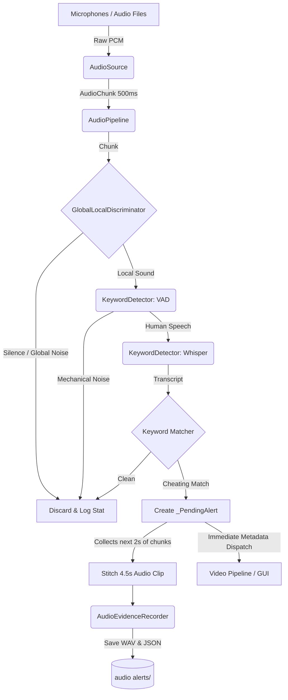

# Thaqib Audio System Architecture & Data Flow

This document breaks down the core architecture of the Thaqib Audio System. The system is designed to continuously monitor multiple microphones, intelligently filter out ambient room noise, and use AI to transcribe and flag specific cheating-related whispers.

## High-Level Data Flow

The system processes audio continuously in 500ms chunks. Here is the step-by-step lifecycle of a single chunk of audio as it travels through the pipeline:

---

## 1. Data Ingestion (`source.py`)

The pipeline begins by capturing audio. It abstracts the hardware away using the `AudioSource` base class.

*   **`LiveAudioSource`**: Connects to physical microphones via the `sounddevice` library. It reads audio streams continuously into a non-blocking queue.
*   **`FileAudioSource`**: Loads pre-recorded files (e.g., `back.mp3`, `front.m4a`) using `pydub`/`librosa` and simulates a live stream.

**Output:** Every 500 milliseconds, the source packages the raw numpy arrays for all connected microphones into an `AudioChunk` dataclass.

---

## 2. The Orchestrator (`pipeline.py`)

The `AudioPipeline` is the heart of the system. It runs in a background thread to ensure audio is processed continuously without freezing the main application GUI.

*   **Rolling History**: It maintains a `_chunk_history` (a rolling buffer of the last 10 seconds of audio). This is what enables the system to "look back in time" when cheating is detected.
*   **Routing**: It acts as the traffic controller, taking the `AudioChunk` and passing it sequentially to the Discriminator and then the Detector.

---

## 3. Spatial Intelligence (`discriminator.py`)

Processing AI speech-to-text is computationally expensive. If a proctor is giving instructions to the whole room, we do not want to transcribe it. 

The `GlobalLocalDiscriminator` solves this by calculating the Root Mean Square (RMS) energy of the 500ms chunk for every microphone.
*   **`SILENT`**: Energy across all mics is below the `silence_threshold`. (Skipped)
*   **`GLOBAL`**: Sound is heard loudly across a high percentage of microphones (e.g., proctor talking, door slamming). (Skipped)
*   **`LOCAL`**: Sound is loud on only 1 or 2 specific microphones. This implies a localized whisper between adjacent students. (Proceeds to AI)

---

## 4. Speech Analysis (`keyword_detector.py`)

When a sound is classified as `LOCAL`, the audio for that specific microphone is analyzed in two stages.

### Stage 1: Voice Activity Detection (Silero VAD)
To prevent coughing, rustling papers, or chair squeaks from triggering the heavy Whisper model, the audio is first passed through a lightweight PyTorch VAD model. The model processes the 500ms chunk in tiny 32ms (512-sample) windows. If it detects high probability of human vocal cords, it proceeds.

### Stage 2: Whisper STT & Matching
The audio is transcribed using OpenAI's **Whisper** model (typically the `tiny` or `base` Arabic model). The resulting text is then cross-referenced against `keywords.json`.
*   It checks for exact matches.
*   It checks for fuzzy matches (if a student mumbles and Whisper captures "إلوض" instead of "إلوضع", the fuzzy threshold can still flag it based on context words).

---

## 5. Evidence Collection (`evidence.py` & `pipeline.py`)

If a cheating keyword is matched, the system must secure forensic evidence.

1.  **Pending Alert**: `pipeline.py` extracts the last 2 seconds of audio from the `_chunk_history` buffer and pairs it with the incident chunk.
2.  **Post-buffering**: It holds this `_PendingAlert` open while it collects the *next* 2 seconds of incoming audio chunks.
3.  **Stitching**: Once complete, it concatenates the arrays to form a seamless ~4.5 second clip containing the full context of the whisper.
4.  **Archiving**: `AudioEvidenceRecorder` saves this clip as a `.wav` file in the `audio alerts` folder, alongside a `.json` file detailing the exact transcript, keywords, and mic ID.
5.  **Dispatch**: Simultaneously, the alert metadata is instantly pushed to the `alert_queue` and the GUI, allowing proctors to see the alert in real-time even while the audio clip finishes saving in the background.

---

## 6. Real-time Dashboard (`demo_audio.py`)

The standalone demo file ties it all together by connecting the pipeline to OpenCV.
*   It registers callbacks (`on_chunk`, `on_alert`) with the pipeline.
*   It renders the energy bars, color-codes them (Green = Normal, Orange = Local Sound), and displays live transcripts.
*   **Interactive Playback**: It manages a separate playback queue and `sounddevice.OutputStream`. If a user clicks a "LISTEN" button, it intercepts the raw audio chunks from the pipeline and streams them directly to the system speakers.
