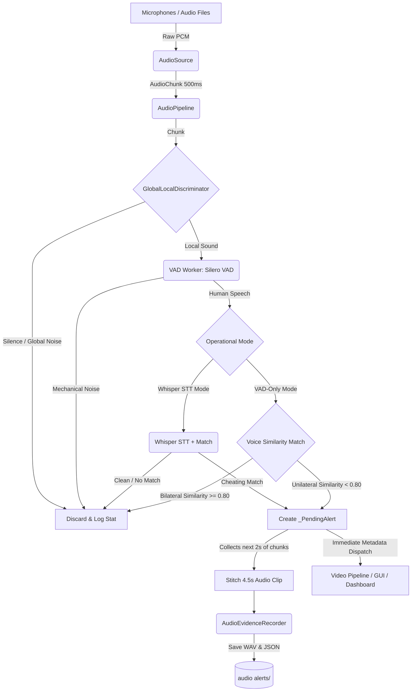

# Thaqib Audio System Architecture & Data Flow

This document breaks down the core architecture of the Thaqib Audio System. The system is designed to continuously monitor multiple microphones, intelligently filter out ambient room noise, and use AI to transcribe and flag specific cheating-related whispers.

## High-Level Data Flow

The system processes audio continuously in 500ms chunks. Here is the step-by-step lifecycle of a single chunk of audio as it travels through the pipeline:



---

## 1. Data Ingestion (`source.py`)

The pipeline begins by capturing audio. It abstracts the hardware away using the `AudioSource` base class.

*   **`LiveAudioSource`**: Connects to physical microphones via the `sounddevice` library. It reads audio streams continuously into a non-blocking queue.
*   **`FileAudioSource`**: Loads pre-recorded files (e.g., `back.mp3`, `front.m4a`) using `pydub`/`librosa` and simulates a live stream.

**Output:** Every 500 milliseconds, the source packages the raw numpy arrays for all connected microphones into an `AudioChunk` dataclass.

---

## 2. The Orchestrator (`pipeline.py`)

The `AudioPipeline` is the heart of the system. It uses a **multi-threaded architecture** to ensure Whisper's heavy transcription latency or blocking disk writes never block real-time chunk processing:

#### A. Whisper STT Mode (Three-Thread Flow)
```
Main Loop Thread (AudioPipeline)
   ├── Reads chunks from AudioSource
   ├── Classifies: SILENT / GLOBAL / LOCAL (fast)
   ├── Feeds noise samples to Preprocessor
   ├── Streams audio to SessionRecorder
   └── Enqueues LOCAL chunks → _inference_queue
            │
            ▼
VAD Worker Thread (~5ms per chunk)
   ├── Runs Silero VAD on LOCAL chunks
   ├── Accumulates speech buffers (2.5s default)
   └── Pushes ready buffers → _whisper_queue
            │
            ▼
Whisper Worker Thread (~0.5–4s per buffer)
   ├── Runs Whisper STT + keyword matching
   ├── Creates AudioAlert objects
   └── Saves evidence (WAV + JSON) via Async Writer
```

#### B. VAD-Only Mode (Two-Thread Flow)
```
Main Loop Thread (AudioPipeline)
   ├── Reads chunks from AudioSource
   ├── Classifies: SILENT / GLOBAL / LOCAL (fast)
   ├── Feeds noise samples to Preprocessor
   ├── Streams audio to SessionRecorder
   └── Enqueues LOCAL chunks → _inference_queue
            │
            ▼
VAD Worker Thread (~5ms per chunk)
   ├── Runs Silero VAD on LOCAL chunks for all mics
   ├── Finds dominant mic & runs Voice Content Similarity (cosine dot product)
   └── Directly creates alerts & saves evidence via Async Writer
```

*   **Rolling History**: It maintains a `_chunk_history` (a rolling buffer of the last 10 seconds of audio). This is what enables the system to "look back in time" when cheating is detected.
*   **Non-blocking Design**: The main loop never waits for AI inference. LOCAL chunks are dropped with a warning if the inference queue fills up, rather than stalling audio ingestion.

---

## 3. Spatial Intelligence (`discriminator.py`)

Processing AI speech-to-text is computationally expensive. If a proctor is giving instructions to the whole room, we do not want to transcribe it. 

The `GlobalLocalDiscriminator` solves this by calculating the Root Mean Square (RMS) energy of the audio chunk for every microphone and classifying it:
*   **`SILENT`**: Energy across all mics is below the `silence_threshold`. (Skipped)
*   **`LOCAL`**: Sound is localized near a subset of microphones. 
    - **1-Mic Mode**: Any non-silent chunk is classified as `LOCAL` with active mic `[0]`.
    - **2-Mic Mode**: Calibrates the baseline energy ratio (median ratio of Mic0/Mic1) during the first 30 non-silent chunks. Post-calibration, it normalizes energies symmetrically and triggers `LOCAL` when the normalized ratio exceeds the threshold multiplier (default `2.0x`).
    - **N-Mic Mode ($N \ge 3$)**: Performs dynamic baseline scale learning relative to the session average ($\text{ratio}_i = \text{energy}_i / \text{mean\_energy}$) during the calibration phase. Post-calibration, it normalizes each channel's energy before evaluating the heard fraction relative to the loudest mic.
    - **Hangover**: A 6-chunk (1.5s) hangover window is applied to $N \ge 2$ modes to prevent rapid decision flipping between channels during sustained whispers.
*   **`GLOBAL`**: Sound is heard globally across the room (e.g. proctor talking, door slamming) and is filtered out. (Skipped)

---

## 4. Speech Analysis (`keyword_detector.py`)

When a sound is classified as `LOCAL`, the audio is analyzed in one of two ways based on the operational mode:

### A. VAD-Only Mode (`AUDIO_VAD_ONLY = true`)
- **Stage 1 (Per-Mic VAD)**: Silero VAD runs on each microphone independently. The mic with the highest speech confidence is designated the *dominant* mic. If its confidence is $\ge$ `AUDIO_VAD_THRESHOLD`, speech is active.
- **Stage 2 (Voice Content Similarity)**: Compares the spectral fingerprint of the dominant mic against other active mics using magnitude spectrum cosine similarity:
  $$\text{Similarity} = \frac{\vec{S}_{\text{dom}} \cdot \vec{S}_{\text{other}}}{\|\vec{S}_{\text{dom}}\|_2 \|\vec{S}_{\text{other}}\|_2}$$
  - If similarity $\ge 0.80$, the sound is bilateral (heard identically by all mics, e.g., proctor speaking) $\rightarrow$ classified as **GLOBAL** noise (no alert).
  - If similarity $< 0.80$, the speech is unique to the dominant mic $\rightarrow$ classified as **LOCAL** $\rightarrow$ triggers an immediate **unauthorized speech alert** without Whisper STT.

### B. Whisper STT Mode (`AUDIO_VAD_ONLY = false`)
- **Stage 1 (Voice Activity Detection)**: Runs Silero VAD on the dominant mic. Chunks of speech are accumulated in a buffer until it reaches `AUDIO_SPEECH_BUFFER_SEC` (default: 2.5s).
- **Stage 2 (Whisper STT & Matching)**: The buffer is sent to the Whisper worker thread, which transcribes it and matches it against `keywords.json` using exact substrings and word-level fuzzy matching. In strict mode (`AUDIO_STRICT_MODE = true`), any speech is flagged.

---

## 5. Pipeline Health Monitor (Load-Shedding)

To prevent queue choking and inference latency spikes under heavy computational load, a background thread monitors the state of `_inference_queue` and `_whisper_queue`:
- **`NORMAL` State** (`_whisper_queue.qsize() <= 1`): Restores the high-fidelity configured beam size (e.g., `beam_size = 3`).
- **`CRITICAL` State** (`_whisper_queue.qsize() >= 3`): Triggers dynamic load-shedding, forcing `beam_size = 1` in the `KeywordDetector` to accelerate Whisper transcription.

---

## 6. Evidence Collection (`evidence.py` & `pipeline.py`)

If a cheating keyword is matched, the system secures forensic evidence:

1.  **Strict Boundary Clipping**: To satisfy tight memory and forensic rules, the output WAV clip contains strictly:
    $$\text{Clip Duration} = \text{Exactly 1.0s Pre-Event Buffer} + \text{Live Cheating Incident Duration}$$
    All post-event padding and grace periods are removed / zeroed out.
2.  **Pending Alert**: `pipeline.py` extracts the exact number of history chunks corresponding to 1.0 second of pre-event audio from `_chunk_history` and pairs it with the speech buffer.
3.  **Archiving**: `AudioEvidenceRecorder` saves the stitched clip as a `.wav` file in the `audio alerts` folder, alongside a `.json` metadata file including a SHA-256 integrity signature.
4.  **Dispatch**: Simultaneously, alert metadata is instantly pushed to the `alert_queue` and the GUI for proctor visualization.

---

## 6. Real-time Dashboard (`demo_audio.py`)

The standalone demo file ties it all together by connecting the pipeline to OpenCV.
*   It registers callbacks (`on_chunk`, `on_alert`) with the pipeline.
*   It renders the energy bars, color-codes them (Green = Normal, Orange = Local Sound), and displays live transcripts.
*   **Interactive Playback**: It manages a separate playback queue and `sounddevice.OutputStream`. If a user clicks a "LISTEN" button, it intercepts the raw audio chunks from the pipeline and streams them directly to the system speakers.
