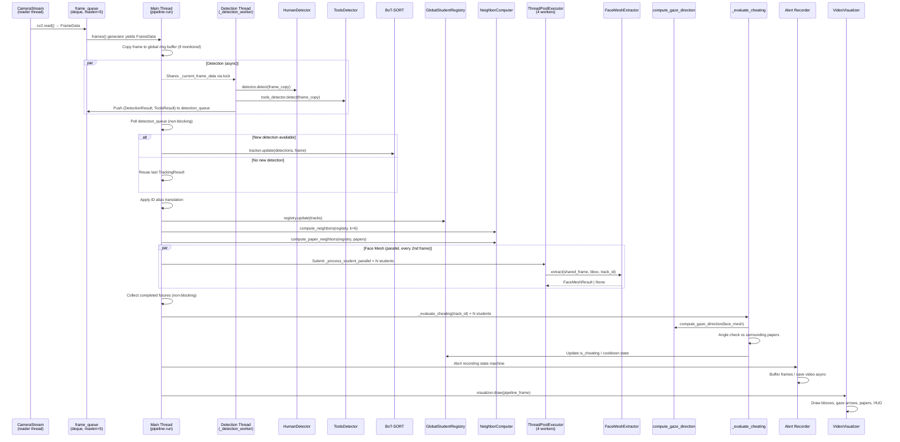
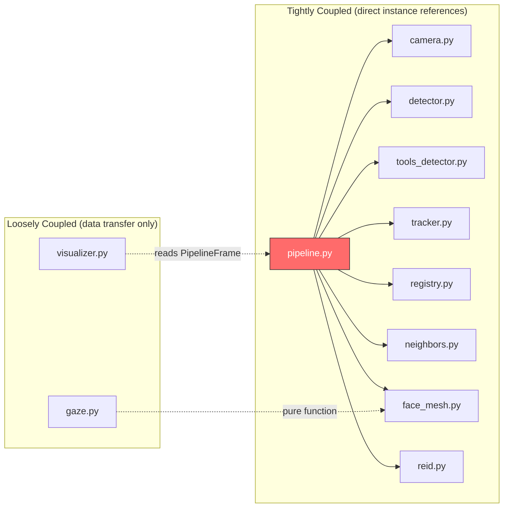

# Thaqib — Exhaustive Codebase Analysis

> **Scope**: 12 source files, ~2,700 lines of Python. Analysis performed on the post-fix codebase (April 16, 2026).

---

## Table of Contents

1. [Architecture & Data Flow](#1-architecture--data-flow-analysis)
2. [Logic & Edge Case Analysis](#2-logic--edge-case-analysis)
3. [Performance & Bottleneck Analysis](#3-performance--bottleneck-analysis)
4. [Dependency & Integration Health](#4-dependency--integration-health)
5. [Actionable Refactoring Plan](#5-actionable-refactoring-plan)

---

## 1. Architecture & Data Flow Analysis

### 1.1 Complete Frame Lifecycle



### 1.2 Thread Architecture Map

| Thread | File | Purpose | Shared State |
|--------|------|---------|-------------|
| **Main** | pipeline.py `run()` | Frame processing loop, cheating eval, recording collector | Everything |
| **CameraReader** | camera.py `_update_loop` | Reads frames from cv2.VideoCapture | `_frame_queue` (deque) |
| **DetectionWorker** | pipeline.py `_detection_worker` | Runs YOLO person + tools detection | `_current_frame_data` (via lock), `_detection_queue` |
| **FaceMesh Pool** | pipeline.py (ThreadPoolExecutor) | MediaPipe face landmark extraction | `shared_frame` (read-only), `_face_extractor` |
| **AlertWriter-N** | pipeline.py `_save_alert_video_async` | Saves .mp4 files | `frames` list (independent copy) |

> [!WARNING]
> **Tight coupling**: `pipeline.py` is a 687-line God Object that directly orchestrates detection, tracking, neighbor computation, face mesh extraction, cheating evaluation, and alert recording. It holds mutable references to 8 subsystem instances and manages 5 concurrent threads. This is the single biggest architectural risk.

### 1.3 Module Coupling Analysis



**Verdict**: `visualizer.py` and `gaze.py` are well-decoupled (good). Everything else is tightly coupled through `pipeline.py`. The pipeline should be refactored into a **Mediator** or **Pipeline-of-Stages** pattern where each stage is independently testable.

---

## 2. Logic & Edge Case Analysis

### 2.1 Decision Algorithm Implication Map

Below is an "If X, then what?" analysis of every critical decision point:

#### 🔍 Scenario 1: Student enters frame mid-session
- **Path**: YOLO detects person → BoT-SORT assigns new track_id → Registry creates new `StudentSpatialState` → NeighborComputer includes them in distance matrix
- **Issue**: The new student immediately becomes a neighbor candidate. If they're standing (e.g., walking to their seat), their large bounding box will have a low `paper_center` that sits far below the desk line, creating a **phantom paper location** for their neighbors.
- **Impact**: Other students may be falsely flagged for looking at a non-existent paper.

> [!CAUTION]
> **False positive risk**: [neighbors.py:146-150](file:///c:/VS%20code%20Clone/Thaqib---Smart-Cheating-Detection-System/src/thaqib/video/neighbors.py#L146-L150) — the heuristic fallback always assigns `paper_center` (bottom of bbox) even for standing/walking students who have no paper.

#### 🔍 Scenario 2: Tracking lost momentarily (occlusion)
- **Path**: BoT-SORT drops track → `track_buffer=120` means 4 seconds before purge → Pipeline reuses `_last_tracking_result` on non-detection frames
- **Issue**: During reuse, the track keeps its **last known position** indefinitely. The student may have moved, but neighbors are computed against stale coordinates.
- **Impact**: Neighbor graph and paper assignment will be incorrect until next detection cycle.

#### 🔍 Scenario 3: Two students swap seats
- **Path**: BoT-SORT reassigns IDs → ReID module detects mismatch → alias mapping redirects new ID to old ID
- **Issue**: If both students swapped simultaneously, the alias system creates `A→B` but has no guard for `B→A` at the same time. [pipeline.py:410](file:///c:/VS%20code%20Clone/Thaqib---Smart-Cheating-Detection-System/src/thaqib/video/pipeline.py#L410) checks `best_id not in visible_ids and best_id not in active_aliases` which prevents the cycle, but **both students lose their IDs** during the transition.
- **Impact**: Monitoring gap of ~2-5 seconds for both students.

#### 🔍 Scenario 4: Student looks at their OWN paper
- **Path**: Gaze direction points downward → angle check compares against `surrounding_papers` (neighbor papers only)
- **Safe**: The student's own paper is excluded from `surrounding_papers` by design (Step D in neighbors.py only takes **neighbor-owned** papers). ✅

#### 🔍 Scenario 5: Face not detected (looking away from camera)
- **Path**: MediaPipe returns no landmarks → `face_mesh = None` → `_evaluate_cheating` enters early exit at [pipeline.py:528](file:///c:/VS%20code%20Clone/Thaqib---Smart-Cheating-Detection-System/src/thaqib/video/pipeline.py#L528)
- **Issue**: The cooldown timer decrements even when face is not detected. If a student was cheating and then turns away from camera (hiding face), the cooldown counts 30 frames of "not-looking" and **clears the cheating flag**. The student effectively escapes detection by turning around.
- **Impact**: **False negative** — cheating goes undetected when student faces away.

> [!IMPORTANT]
> **Critical edge case**: A cheating student who turns away from the camera will have their `is_cheating` flag cleared after 1 second, even though they may still be cheating. Consider: if `face_mesh is None`, **freeze** the cooldown instead of decrementing it.

#### 🔍 Scenario 6: Multiple cheating students simultaneously
- **Path**: Each student has independent `is_cheating` + `is_alert_recording` + `recording_buffer`
- **Issue**: Each recording buffer stores up to 300 frames (max ~810MB each at 720p). With 5 simultaneous cheaters, that's **4GB of RAM** just for recording buffers + global frame buffer.
- **Impact**: Potential OOM on systems with < 8GB free RAM.

#### 🔍 Scenario 7: Video file ends during alert recording
- **Path**: Camera returns `None` → `frames()` generator ends → `pipeline.run()` exits → `pipeline.stop()` called
- **Issue**: Any in-progress alert recordings are **silently lost**. The `recording_buffer` is never flushed.
- **Impact**: The final cheating event in a video file is never saved.

#### 🔍 Scenario 8: `detection_interval` is too slow (1.0s default)
- **Path**: Detection runs every 1 second → between detections, tracking reuses last result
- **Issue**: At 30fps, this means **29 out of 30 frames reuse stale tracking data**. Students who move their heads during the 1-second gap are evaluated against outdated positions.
- **Impact**: Delayed detection + inaccurate neighbor computation. The PIPELINE_PERF logs confirm this — "Detection: 0.0 ms" appears on most frames because detection only fires once per second.

#### 🔍 Scenario 9: FaceMesh runs only on even frames ([pipeline.py:377](file:///c:/VS%20code%20Clone/Thaqib---Smart-Cheating-Detection-System/src/thaqib/video/pipeline.py#L377))
- **Path**: On odd frames, face mesh is skipped entirely → no gaze update → cheating evaluation uses stale face mesh from registry
- **Issue**: Combined with detection interval of 1s, effective face mesh cadence is ~15 times/second. This is acceptable for gaze tracking but means cheating evaluation also runs at half-rate.
- **Impact**: Minor — the 2-second suspicious duration threshold compensates for the lower sample rate.

#### 🔍 Scenario 10: Non-blocking future collection ([pipeline.py:393-394](file:///c:/VS%20code%20Clone/Thaqib---Smart-Cheating-Detection-System/src/thaqib/video/pipeline.py#L393-L394))
- **Path**: `if not future.done(): continue` — futures that haven't completed are **skipped**, with no retry mechanism
- **Issue**: If MediaPipe is slow (e.g., CPU contention), a student's face mesh is never collected for that frame. The next even frame submits **new** futures, but the old ones are abandoned. Since `ThreadPoolExecutor` has `max_workers=4`, abandoned futures still consume worker slots until they complete.
- **Impact**: Worker starvation under load. If MediaPipe takes > 66ms per student and there are 13 students, 4 workers can only process 4 students per 66ms cycle. The remaining 9 silently lose their face mesh update.

> [!WARNING]
> **Silent data loss**: Uncollected futures are never checked again. A student who consistently takes longest to process will have stale face mesh data, leading to inaccurate gaze tracking specifically for the students who are hardest to see (smallest bbox → longest MediaPipe inference).

#### 🔍 Scenario 11: Skip-if-stable optimization masks real movement
- **Path**: [neighbors.py:52](file:///c:/VS%20code%20Clone/Thaqib---Smart-Cheating-Detection-System/src/thaqib/video/neighbors.py#L52) — if `max_movement < 20px`, neighbor computation is skipped
- **Issue**: Since tracking reuses stale positions between detection cycles (Scenario 8), the centers barely change, and the skip fires continuously. When a real detection arrives with updated positions, the neighbors update once. But if the detection resolves a student who shifted 15px (under threshold), their neighbors **never update**.
- **Impact**: Marginal — 20px is small enough that neighbor ordering rarely changes. But it interacts badly with the stale tracking data problem.

#### 🔍 Scenario 12: ReID alias collision on same frame
- **Path**: Two face mesh callbacks on the same frame both attempt to alias different tracker IDs to the same ReID target
- **Current protection**: [pipeline.py:410](file:///c:/VS%20code%20Clone/Thaqib---Smart-Cheating-Detection-System/src/thaqib/video/pipeline.py#L410) checks `best_id not in active_aliases`
- **Post-fix status**: Now safe — since ReID runs on the main thread (synchronously iterating futures), aliases are checked sequentially. ✅

#### 🔍 Scenario 13: Gaze angle math with 2D screen-space vectors
- **Path**: [gaze.py](file:///c:/VS%20code%20Clone/Thaqib---Smart-Cheating-Detection-System/src/thaqib/video/gaze.py) computes a 2D direction vector. [pipeline.py:562-568](file:///c:/VS%20code%20Clone/Thaqib---Smart-Cheating-Detection-System/src/thaqib/video/pipeline.py#L562-L568) computes the angle between (2D gaze) and (2D paper direction from head position).
- **Issue**: The gaze vector is a **unit vector** normalized in screen space. The paper direction vector is in **pixel coordinates** (also screen space). The dot product computes the cosine of the angle between them. This is correct for coplanar comparison.
- **However**: The gaze combines 3D head rotation + 2D iris deviation, then projects to 2D. This projection loses depth information. A student looking at a paper 2 meters away and one 30cm away will have similar 2D angles if the papers are in the same screen direction. This makes the system **distance-insensitive**, which is actually desirable for exam hall scenarios. ✅

#### 🔍 Scenario 14: `risk_angle_tolerance = 15°` — is it calibrated?
- **Path**: `threshold = cos(15°) ≈ 0.966`
- **Issue**: This is very tight. The gaze vector has several sources of noise: MediaPipe landmark jitter, iris detection error, head rotation estimation error. A combined error of ~5-10° per axis is common. With a 15° tolerance, the system requires the gaze to be nearly perfectly aligned with the paper direction.
- **Impact**: **High false negative rate** — students may genuinely be looking at a neighbor's paper but the angle check fails due to cumulative measurement noise.

> [!IMPORTANT]
> Consider increasing `RISK_ANGLE_TOLERANCE` to 25-30° to account for the cascaded noise from MediaPipe landmarks + iris detection + perspective distortion.

---

## 3. Performance & Bottleneck Analysis

### 3.1 Measured Performance (from demo run output)

Based on the actual pipeline log with 13 monitored students on 1920×1080 video:

| Stage | Measured | Target (30fps = 33ms budget) | Status |
|-------|---------|------|--------|
| Detection poll | ~50-77ms | <5ms | ⚠️ But async, doesn't block |
| Tracking (BoT-SORT update) | 0-44ms (spikes) | <30ms | ⚠️ CMC spikes |
| Registry | 0.1ms | <1ms | ✅ |
| Neighbors | 0.1-0.6ms | <1ms | ✅ |
| FaceMesh (13 students) | 24-78ms | <33ms | ❌ Bottleneck |
| **Total main thread** | **53-151ms** | **<33ms** | ❌ 7-20 FPS |

### 3.2 Critical Bottlenecks

#### Bottleneck 1: FaceMesh dominates main thread time

Despite using a ThreadPoolExecutor, the main thread still spends 24-78ms in the face mesh section because:
1. [pipeline.py:380](file:///c:/VS%20code%20Clone/Thaqib---Smart-Cheating-Detection-System/src/thaqib/video/pipeline.py#L380): `shared_frame = frame_data.frame.copy()` — 1920×1080×3 = **6.2MB copy** per even frame
2. [pipeline.py:393-418](file:///c:/VS%20code%20Clone/Thaqib---Smart-Cheating-Detection-System/src/thaqib/video/pipeline.py#L393-L418): Iterating futures and processing results blocks until all completed futures are consumed

**Fix**: Submit futures on frame N, collect results on frame N+2. This decouples submission from collection.

#### Bottleneck 2: Global frame buffer copies

[pipeline.py:277](file:///c:/VS%20code%20Clone/Thaqib---Smart-Cheating-Detection-System/src/thaqib/video/pipeline.py#L277): `self._global_frame_buffer.append(frame_data.frame.copy())` — 6.2MB copy **every frame** when monitoring is active. At 30fps, that's **186MB/s** of memory traffic just for buffering.

#### Bottleneck 3: Alert recording frame copies

[pipeline.py:442](file:///c:/VS%20code%20Clone/Thaqib---Smart-Cheating-Detection-System/src/thaqib/video/pipeline.py#L442): `state.recording_buffer.append(frame_data.frame.copy())` — additional 6.2MB copy per actively recording student per frame. With 3 concurrent recordings, that's **18.6MB/frame** extra.

#### Bottleneck 4: Visualizer frame copy

[visualizer.py:64](file:///c:/VS%20code%20Clone/Thaqib---Smart-Cheating-Detection-System/src/thaqib/video/visualizer.py#L64): `annotated = pipeline_frame.frame.copy()` — another 6.2MB copy for display.

**Total frame copies per frame** (worst case, 3 students recording):
```
Ring buffer:     6.2 MB
Recording ×3:   18.6 MB  
FaceMesh copy:   6.2 MB  (every 2nd frame → amortized 3.1 MB)
Visualizer:      6.2 MB
Detection:       6.2 MB  (async thread, amortized ~0.2 MB/frame at 1Hz)
─────────────────────────
Total:          ~37 MB per frame, ~1.1 GB/s at 30fps
```

### 3.3 Memory Leak Audit

| Location | Leak Risk | Details |
|----------|----------|---------|
| `tracker._smoothed_bboxes` | 🟡 Slow growth | Never pruned for disappeared track IDs. Grows unboundedly if IDs increase monotonically. |
| `tracker._match_counts` | 🟡 Slow growth | Same — never pruned. |
| `tracker._locked_ids` | 🟡 Slow growth | Same — never pruned. |
| `face_mesh._mesh_cache` | 🟡 Slow growth | Cache entries for lost students are never evicted. Only TTL-based (0.3s), but the dict key stays. |
| `reid._embeddings` | ✅ Cleaned | Purged via `remove_embeddings()` when registry expires IDs. |
| `registry._states` | ✅ Cleaned | 10-second expiry with explicit deletion. |
| `_track_aliases` | ✅ Cleaned | Cleaned when expired IDs detected. |

> [!WARNING]
> **Tracker memory leak**: [tracker.py:104,108,111,112](file:///c:/VS%20code%20Clone/Thaqib---Smart-Cheating-Detection-System/src/thaqib/video/tracker.py#L104-L112) — `_smoothed_bboxes`, `_track_labels`, `_locked_ids`, and `_match_counts` are never pruned for disappeared IDs. During a multi-hour exam, BoT-SORT may create hundreds of unique track IDs (from brief false detections, room entries, etc.), and each leaves an orphaned entry. Fix: prune when pipeline removes expired IDs from registry.

### 3.4 GIL Contention Analysis

The system uses **threading** (not multiprocessing). Python's GIL means:
- **CPU-bound work** (numpy, MediaPipe inference) does not truly parallelize across cores
- **However**, MediaPipe internally uses native threads (via XNNPACK delegate) which release the GIL
- Numpy operations also release the GIL for large array computations

**Verdict**: The ThreadPoolExecutor for face mesh works because MediaPipe's `.detect()` call runs in C++ (GIL-released). However, the Python overhead of processing results, computing embeddings, and evaluating cheating all hold the GIL.

---

## 4. Dependency & Integration Health

### 4.1 OpenCV (cv2)

| Usage | File | Status |
|-------|------|--------|
| `VideoCapture` | camera.py | ✅ Correct usage. Backend selection per-platform is good. |
| `resize` with `INTER_LINEAR` | tracker.py:165 | ✅ Appropriate for downscaling. |
| `cvtColor` BGR→RGB | face_mesh.py:160 | ✅ Required for MediaPipe. |
| `VideoWriter` with codec fallback | pipeline.py:628 | ⚠️ `avc1` may not be available on Windows without OpenH264 DLL. `mp4v` fallback is correct. |
| `addWeighted` on ROI | visualizer.py:335,395 | ✅ Correct ROI-only optimization. |

#### Issue: `CAP_DSHOW` on Windows
[camera.py:101](file:///c:/VS%20code%20Clone/Thaqib---Smart-Cheating-Detection-System/src/thaqib/video/camera.py#L101) — DirectShow is used for webcams on Windows. This is correct for USB cameras but may cause issues with virtual cameras (OBS, DroidCam). No flag to override.

### 4.2 Ultralytics YOLO

| Usage | File | Status |
|-------|------|--------|
| `self._model.to("cuda")` | detector.py:114 | ⚠️ **Hardcoded CUDA**. Will crash on CPU-only systems. `tools_detector.py` does it correctly (line 68: checks `torch.cuda.is_available()`). |
| `self._model(frame, device="cuda")` | detector.py:144 | ⚠️ Same — **double device specification**. The `.to()` should be enough. |
| Warmup with dummy image | tools_detector.py:76-77 | ✅ Good practice for CUDA. `detector.py` doesn't do warmup — first inference will be slow. |

> [!WARNING]
> [detector.py:113-114](file:///c:/VS%20code%20Clone/Thaqib---Smart-Cheating-Detection-System/src/thaqib/video/detector.py#L113-L114): Hardcoded `self._model.to("cuda")` and `device="cuda"` in inference. Will crash on CPU-only machines. Should use the same `torch.cuda.is_available()` check as `tools_detector.py`.

### 4.3 MediaPipe

| Usage | File | Status |
|-------|------|--------|
| `RunningMode.IMAGE` | face_mesh.py:88 | ⚠️ Suboptimal. `VIDEO` mode enables temporal smoothing (reduces jitter between frames). `IMAGE` mode treats each crop independently. |
| `output_facial_transformation_matrixes=True` | face_mesh.py:94 | ✅ Required for gaze computation. |
| `min_face_detection_confidence=0.80` | face_mesh.py:90 | ⚠️ Very high — distant students (small bbox → small crop) may not reach 0.80. Consider lowering to 0.50. |

### 4.4 BoT-SORT (boxmot)

| Config | Value | Assessment |
|--------|-------|------------|
| `with_reid=False` | tracker.py:243 | ✅ Correct — custom ReID is used instead. |
| `track_buffer=120` | tracker.py:248 | ⚠️ **4 seconds** at 30fps. Very long — ghost tracks persist for 4s after student disappears. |
| `match_thresh=0.9` | tracker.py:249 | ⚠️ Very permissive. Allows weak matches that may cause ID switches. |
| `track_high_thresh=0.25` | tracker.py:245 | ✅ Low enough to catch low-confidence detections. |
| `fuse_first_associate=True` | tracker.py:244 | ✅ Improves re-association after brief occlusion. |

### 4.5 Unused / Unnecessary Imports

| File | Import | Status |
|------|--------|--------|
| tracker.py:10 | `import inspect` | ❌ **Unused** — dead import. |
| tracker.py:13 | `from typing import Optional` | ❌ **Unused** — no `Optional` used. |
| pipeline.py:14 | `from concurrent.futures import ... as_completed` | ❌ **Unused** — `as_completed` is imported but never called. |
| detector.py:10 | `import cv2` | ❌ **Unused** — cv2 is not used in detector.py. |
| registry.py:9 | `import numpy as np` | ⚠️ Only used for type hint `np.ndarray`. Could use `from __future__ import annotations`. |

---

## 5. Actionable Refactoring Plan

Prioritized by **impact × effort**, grouped into immediate fixes, medium-term improvements, and architectural upgrades.

---

### 🔴 P0 — Immediate Fixes (High Impact, Low Effort)

#### Fix 1: Freeze cooldown when face not detected
**File**: [pipeline.py:528-536](file:///c:/VS%20code%20Clone/Thaqib---Smart-Cheating-Detection-System/src/thaqib/video/pipeline.py#L528-L536)
**Why**: A cheating student who turns away from the camera gets their `is_cheating` flag cleared because the cooldown decrements even when there's no face mesh data. They effectively escape detection.
```diff
         if not state or not state.face_mesh or not state.surrounding_papers:
             if state:
                 state.suspicious_start_time = 0.0
-                # Apply cooldown before clearing cheating flag
-                if state.is_cheating:
-                    state.cheating_cooldown -= 1
-                    if state.cheating_cooldown <= 0:
-                        state.is_cheating = False
+                # Do NOT decrement cooldown when face is not detected.
+                # The student may be actively hiding their face during cheating.
+                # Cooldown should only tick when we have positive gaze evidence
+                # that the student is NOT looking at a paper.
             return
```
Same fix at [pipeline.py:541-548](file:///c:/VS%20code%20Clone/Thaqib---Smart-Cheating-Detection-System/src/thaqib/video/pipeline.py#L541-L548) (gaze_dir is None).

---

#### Fix 2: Hardcoded CUDA device in detector.py
**File**: [detector.py:113-114](file:///c:/VS%20code%20Clone/Thaqib---Smart-Cheating-Detection-System/src/thaqib/video/detector.py#L113-L114) and [detector.py:144](file:///c:/VS%20code%20Clone/Thaqib---Smart-Cheating-Detection-System/src/thaqib/video/detector.py#L144)
**Why**: Crashes on CPU-only machines. `tools_detector.py` already does this correctly.
```diff
+        import torch
+        device = "cuda" if torch.cuda.is_available() else "cpu"
-        self._model.to("cuda")
+        self._model.to(device)
+        self._device = device

         # In detect():
-        device="cuda",
+        device=self._device,
```

---

#### Fix 3: Flush pending recordings on pipeline stop
**File**: [pipeline.py:231-240](file:///c:/VS%20code%20Clone/Thaqib---Smart-Cheating-Detection-System/src/thaqib/video/pipeline.py#L231-L240)
**Why**: When video file ends or user quits, any in-progress alert recordings are silently lost.
```diff
     def stop(self) -> None:
         """Stop the pipeline."""
         logger.info("Stopping video pipeline...")
         self._is_running = False
+        
+        # Flush any in-progress alert recordings before shutdown
+        for state in self._registry.get_all():
+            if state.is_alert_recording and len(state.recording_buffer) > 0:
+                frames_snapshot = list(state.recording_buffer)
+                state.is_alert_recording = False
+                self._save_alert_video_async(frames_snapshot, state.track_id, time.time())
+        
         if self._detection_thread is not None:
             self._detection_thread.join(timeout=1.0)
```

---

#### Fix 4: Prune tracker memory for disappeared IDs
**File**: [pipeline.py:333-340](file:///c:/VS%20code%20Clone/Thaqib---Smart-Cheating-Detection-System/src/thaqib/video/pipeline.py#L333-L340)
**Why**: `_smoothed_bboxes`, `_match_counts`, `_locked_ids` grow unboundedly.
```diff
         if expired_ids:
             self._reid.remove_embeddings(expired_ids)
+            # Also clean up tracker state for expired IDs
+            for eid in expired_ids:
+                self._tracker._smoothed_bboxes.pop(eid, None)
+                self._tracker._match_counts.pop(eid, None)
+                self._tracker._locked_ids.discard(eid)
             keys_to_delete = [
```

---

#### Fix 5: Remove dead imports
**Files**: tracker.py, pipeline.py, detector.py
**Why**: Code cleanliness, avoids confusion.

---

### 🟡 P1 — Medium-Term (High Impact, Medium Effort)

#### Fix 6: Double-buffer face mesh futures
**File**: [pipeline.py:375-418](file:///c:/VS%20code%20Clone/Thaqib---Smart-Cheating-Detection-System/src/thaqib/video/pipeline.py#L375-L418)
**Why**: Current approach submits and collects futures on the same frame, wasting time on incomplete ones. Double-buffering submits on frame N and collects on frame N+2.
```python
# Add to __init__:
self._pending_futures: dict[Future, int] = {}

# In _process_frame:
# 1. Collect ANY completed futures from PREVIOUS cycle first
for future in list(self._pending_futures.keys()):
    if future.done():
        self._handle_face_mesh_result(future, self._pending_futures.pop(future))

# 2. Submit NEW futures for this cycle
if frame_data.frame_index % 2 == 0:
    shared_frame = frame_data.frame.copy()
    for state in student_states:
        future = self._face_executor.submit(...)
        self._pending_futures[future] = state.track_id
```

---

#### Fix 7: Face mesh `RunningMode.VIDEO` instead of `IMAGE`
**File**: [face_mesh.py:88](file:///c:/VS%20code%20Clone/Thaqib---Smart-Cheating-Detection-System/src/thaqib/video/face_mesh.py#L88)
**Why**: VIDEO mode enables temporal smoothing, reducing landmark jitter between consecutive frames. Also enables `detect_for_video()` which accepts timestamp, improving tracking consistency.
**Caveat**: VIDEO mode is not thread-safe for concurrent calls from different students. Would need one landmarker instance per worker thread.

---

#### Fix 8: Widen `RISK_ANGLE_TOLERANCE` to 25°
**File**: [settings.py:51](file:///c:/VS%20code%20Clone/Thaqib---Smart-Cheating-Detection-System/src/thaqib/config/settings.py#L51)
**Why**: 15° is too tight given cumulative noise from MediaPipe + iris detection. 25° provides better recall while still being directionally meaningful.

---

#### Fix 9: Reduce frame copy overhead
**File**: [pipeline.py:277,380,442](file:///c:/VS%20code%20Clone/Thaqib---Smart-Cheating-Detection-System/src/thaqib/video/pipeline.py)
**Why**: ~37MB of copies per frame (1.1 GB/s) is the single largest CPU overhead.
- **Ring buffer**: Use `np.copyto()` with pre-allocated arrays instead of `deque` of copies.
- **FaceMesh**: Share frame reference without copy if camera thread guarantees frame immutability after yielding (current `deque(maxlen=5)` could overwrite).
- **Recording**: Downscale to 720p before buffering.

---

#### Fix 10: Add warmup to `HumanDetector.load()`
**File**: [detector.py:106-117](file:///c:/VS%20code%20Clone/Thaqib---Smart-Cheating-Detection-System/src/thaqib/video/detector.py#L106-L117)
**Why**: First YOLO inference on CUDA is slow (kernel compilation). `tools_detector.py` already does warmup. Add the same pattern.

---

### 🟢 P2 — Architectural Improvements (High Impact, High Effort)

#### Fix 11: Extract cheating evaluation into its own module
**Why**: `_evaluate_cheating` is 80 lines of domain logic embedded in the 687-line orchestrator. It should be `cheating_evaluator.py` with a pure function signature:
```python
def evaluate_cheating(state: StudentSpatialState, gaze_dir, settings) -> CheatingDecision:
```

#### Fix 12: Pipeline-of-Stages architecture
**Why**: The monolithic `_process_frame` makes it impossible to unit-test individual stages. Refactor into:
```
FrameIngestion → Detection → Tracking → Registry → Neighbors → FaceMesh → CheatingEval → AlertRecording
```
Each stage takes typed input and produces typed output, connected via queues.

#### Fix 13: Replace ThreadPoolExecutor with multiprocessing for face mesh
**Why**: True parallelism for CPU-bound MediaPipe inference. Requires shared memory for frame passing (e.g., `multiprocessing.shared_memory`).

---

### Summary Matrix

| ID | Fix | Priority | Impact | Effort | File |
|----|-----|----------|--------|--------|------|
| 1 | Freeze cooldown on no face | P0 | High | 5 min | pipeline.py:528-548 |
| 2 | Hardcoded CUDA device | P0 | High | 5 min | detector.py:113-144 |
| 3 | Flush recordings on stop | P0 | Med | 10 min | pipeline.py:231 |
| 4 | Prune tracker memory | P0 | Med | 5 min | pipeline.py:333 |
| 5 | Remove dead imports | P0 | Low | 2 min | tracker.py, pipeline.py, detector.py |
| 6 | Double-buffer face mesh | P1 | High | 30 min | pipeline.py:375 |
| 7 | FaceMesh VIDEO mode | P1 | Med | 1 hr | face_mesh.py:88 |
| 8 | Widen angle tolerance | P1 | Med | 1 min | settings.py:51 |
| 9 | Reduce frame copies | P1 | High | 2 hrs | pipeline.py (multiple) |
| 10 | Detector warmup | P1 | Low | 5 min | detector.py:106 |
| 11 | Extract cheating evaluator | P2 | Med | 1 hr | pipeline.py → cheating_evaluator.py |
| 12 | Pipeline-of-Stages | P2 | High | 1 day | Full refactor |
| 13 | Multiprocessing face mesh | P2 | High | 2 days | pipeline.py, face_mesh.py |
