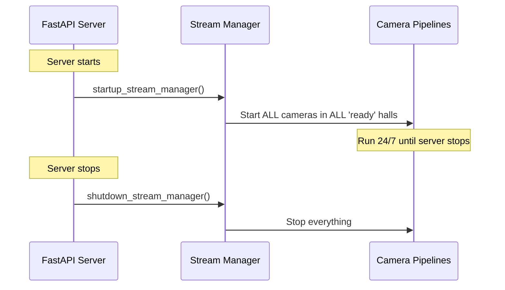
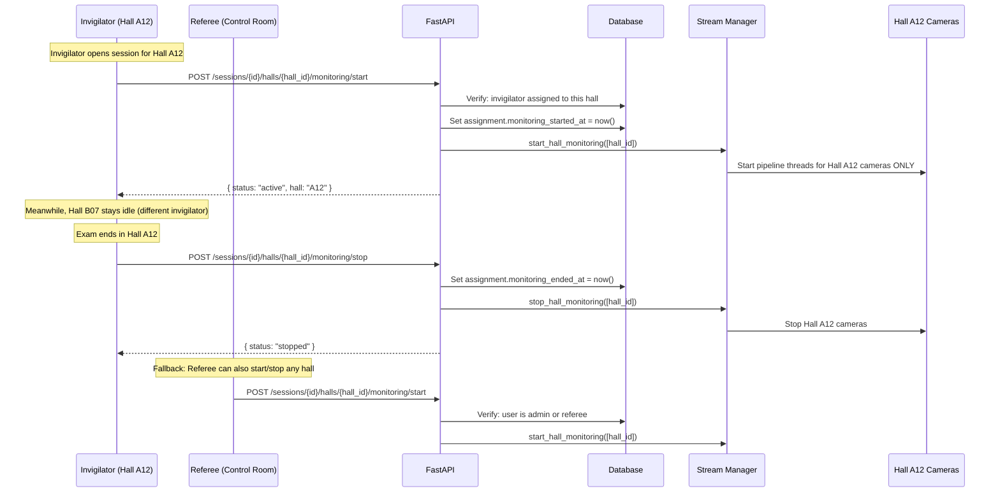
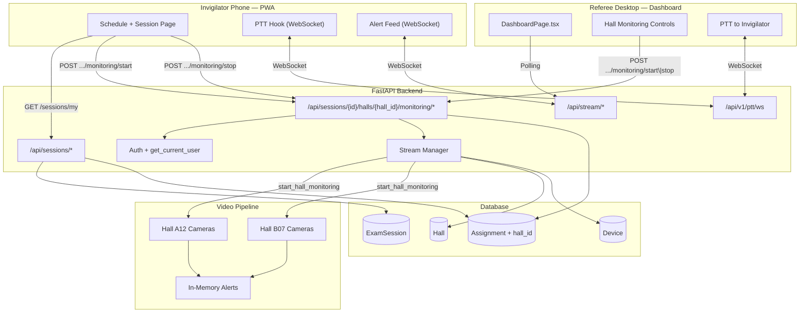

# Invigilator Dashboard — Implementation Plan (v3 — Final)

## Decisions Locked ✅

| Decision | Choice |
|---|---|
| Platform | PWA (same Vite + React app, role-based routing) |
| Live camera feeds for invigilator | No — snapshots + PTT instead |
| Alert routing | Option A — referee-mediated (referee claims → PTT → invigilator) |
| Who can start/stop monitoring | Both invigilator AND referee/admin (fallback) |
| Push notifications | Skip for now — in-app WebSocket alerts are sufficient |
| Monitoring scope | **Per-hall** — invigilator starts/stops only their assigned hall |

---

## 1. Critical Schema Gap: Assignment Needs `hall_id`

### The Problem

The user clarified: **each invigilator is assigned to a single hall**, not to the entire session. But the current `Assignment` model is:

```python
class Assignment(Base):
    exam_session_id  # ← links to the session
    invigilator_id   # ← links to the user
    role             # ← 'primary' or 'secondary'
    # ❌ No hall_id — we don't know WHICH hall this invigilator covers
```

An exam session can span multiple halls (e.g., "Physics Final" in halls A12, B07, C03). Three invigilators are assigned, one per hall. But right now there's no way to know who goes where.

### The Fix

Add `hall_id` to `Assignment`:

```python
class Assignment(Base, UUIDMixin, TimestampMixin):
    __tablename__ = "assignments"

    exam_session_id: Mapped[uuid.UUID] = mapped_column(
        ForeignKey("exam_sessions.id", ondelete="CASCADE"), nullable=False
    )
    invigilator_id: Mapped[uuid.UUID] = mapped_column(
        ForeignKey("users.id", ondelete="RESTRICT"), nullable=False
    )
    hall_id: Mapped[uuid.UUID] = mapped_column(                    # ← NEW
        ForeignKey("halls.id", ondelete="CASCADE"), nullable=False  # ← NEW
    )
    role: Mapped[str] = mapped_column(String(20), default="primary")

    # Relationships
    exam_session = relationship("ExamSession", back_populates="assignments")
    invigilator = relationship("User", back_populates="assignments")
    hall = relationship("Hall")                                     # ← NEW
```

> [!WARNING]
> **This requires an Alembic migration** (or manual `ALTER TABLE assignments ADD COLUMN hall_id ...`). Since the system uses SQLite in dev, this is straightforward. Any existing assignment rows will need to be re-created with a `hall_id`.

### Validation on Assignment Creation

When assigning an invigilator, the API must verify:
1. The `hall_id` belongs to the exam session's linked halls (via `exam_session_halls`)
2. No other invigilator is already assigned as `primary` to that same hall for the same session

---

## 2. The Start/End Monitoring Lifecycle — Per-Hall

### Current Architecture (the problem)



**Problems:** No exam-session awareness. Cameras run on empty halls. No audit trail. GPU/CPU waste.

### Target Architecture (per-hall, invigilator-triggered)



### Key Design Details

**Per-hall, not per-session:**
- Each hall is independently startable/stoppable
- The exam session itself transitions to `active` when **any** hall starts, and to `completed` when **all** halls have stopped
- This allows Hall A12 to start 5 minutes before Hall B07 if needed

**Tracking monitoring state:**
Add two fields to `Assignment`:
```python
monitoring_started_at: Mapped[Optional[datetime]]  # When this hall's monitoring began
monitoring_ended_at: Mapped[Optional[datetime]]     # When it ended
```

This gives per-hall audit trail: "Hall A12 monitoring ran from 10:02 AM to 12:05 PM."

**Session-level state derivation:**
```python
# Session status is derived from its halls:
# - 'scheduled' → no halls have started
# - 'active'    → at least one hall has started and not all have stopped
# - 'completed' → all halls have stopped
# - 'cancelled' → manually cancelled
```

The `ExamSession.actual_start` = earliest `assignment.monitoring_started_at` across all halls.
The `ExamSession.actual_end` = latest `assignment.monitoring_ended_at` across all halls.

---

## 3. Backend Changes — Full Inventory

### A. Schema Migration

#### [MODIFY] `Assignment` model — add 3 columns

```python
# In src/thaqib/db/models/exams.py
class Assignment(Base, UUIDMixin, TimestampMixin):
    exam_session_id: ...   # existing
    invigilator_id: ...    # existing
    role: ...              # existing
    
    hall_id: Mapped[uuid.UUID] = mapped_column(                     # NEW
        ForeignKey("halls.id", ondelete="CASCADE"), nullable=False
    )
    monitoring_started_at: Mapped[Optional[datetime]] = mapped_column(  # NEW
        DateTime(timezone=True), nullable=True
    )
    monitoring_ended_at: Mapped[Optional[datetime]] = mapped_column(    # NEW
        DateTime(timezone=True), nullable=True
    )
    
    hall: Mapped["Hall"] = relationship("Hall")                     # NEW
```

#### [MODIFY] `AssignmentCreate` schema — add `hall_id`

```python
class AssignmentCreate(AssignmentBase):
    hall_id: uuid.UUID  # NEW — required when assigning
```

#### [MODIFY] `AssignmentResponse` schema — add new fields

```python
class AssignmentResponse(AssignmentBase):
    id: uuid.UUID
    exam_session_id: uuid.UUID
    hall_id: uuid.UUID                                # NEW
    monitoring_started_at: Optional[datetime] = None  # NEW
    monitoring_ended_at: Optional[datetime] = None    # NEW
```

---

### B. New Stream Manager Functions (stream.py)

```python
def start_hall_monitoring(hall_ids: list[str]) -> dict:
    """Start camera pipelines for specific halls only."""
    # Query devices for these halls
    # Create CameraRuntime + thread for each camera
    # Skip cameras already running
    # Returns {"started_cameras": [...]}

def stop_hall_monitoring(hall_ids: list[str]) -> dict:
    """Stop camera pipelines for specific halls."""
    # Find runtimes where runtime.hall_id in hall_ids
    # Stop each thread
    # Remove from _camera_states
    # Returns {"stopped_cameras": [...]}

def resume_active_sessions() -> None:
    """On server restart, resume monitoring only for halls with active assignments."""
    # Query assignments where monitoring_started_at IS NOT NULL 
    #   AND monitoring_ended_at IS NULL
    # Extract hall_ids
    # Call start_hall_monitoring(hall_ids)
```

---

### C. New API Endpoints (exams.py)

#### `GET /api/sessions/my` — Invigilator's schedule

```python
@router.get("/my", response_model=List[MySessionResponse])
def my_sessions(
    db: Session = Depends(get_db),
    current_user = Depends(get_current_user),
):
    """Get exam sessions assigned to the current invigilator."""
    assignments = (
        db.query(Assignment)
        .filter(Assignment.invigilator_id == current_user.id)
        .options(
            selectinload(Assignment.exam_session),
            selectinload(Assignment.hall).selectinload(Hall.devices),
        )
        .all()
    )
    # Transform to response with session + hall + device status
```

Response includes:
```json
[
  {
    "assignment_id": "...",
    "session": { "exam_name": "Physics Final", "scheduled_start": "...", "status": "scheduled" },
    "hall": { "name": "A12", "building": "Science", "device_count": 6, "devices_online": 6 },
    "monitoring_started_at": null,
    "monitoring_ended_at": null
  }
]
```

#### `POST /api/sessions/{id}/halls/{hall_id}/monitoring/start`

```python
@router.post("/{session_id}/halls/{hall_id}/monitoring/start")
def start_hall_monitoring_endpoint(
    session_id: uuid.UUID,
    hall_id: uuid.UUID,
    db: Session = Depends(get_db),
    current_user = Depends(get_current_user),
):
    """
    Start monitoring for a specific hall in a session.
    
    Auth: Assigned invigilator for this hall, OR admin/referee.
    
    Validates:
    1. Session exists, not cancelled/completed
    2. Hall is linked to this session
    3. User is authorized (assigned invigilator or admin/referee)
    4. Monitoring not already started for this hall
    
    Side effects:
    1. Sets assignment.monitoring_started_at = now()
    2. Updates session.status to 'active' if first hall to start
    3. Updates session.actual_start if first hall to start
    4. Starts camera pipelines for this hall
    """
```

#### `POST /api/sessions/{id}/halls/{hall_id}/monitoring/stop`

```python
@router.post("/{session_id}/halls/{hall_id}/monitoring/stop")
def stop_hall_monitoring_endpoint(
    session_id: uuid.UUID,
    hall_id: uuid.UUID,
    db: Session = Depends(get_db),
    current_user = Depends(get_current_user),
):
    """
    Stop monitoring for a specific hall.
    
    Side effects:
    1. Sets assignment.monitoring_ended_at = now()
    2. Stops camera pipelines for this hall
    3. If ALL halls in this session have stopped → 
       set session.status = 'completed', session.actual_end = now()
    """
```

#### `GET /api/sessions/{id}/halls/{hall_id}/status`

Lightweight polling endpoint for the invigilator PWA:
```json
{
  "monitoring_active": true,
  "started_at": "2026-05-15T10:02:00Z",
  "cameras_online": 6,
  "cameras_total": 6,
  "alert_count": 3,
  "elapsed_seconds": 2712
}
```

---

### D. Modify Existing Endpoints

#### [MODIFY] `assign_invigilator` (exams.py)

Currently doesn't accept `hall_id`. Must:
1. Accept `hall_id` in the request body
2. Validate that `hall_id` is linked to the session (via `exam_session_halls`)
3. Validate no duplicate primary assignment to the same hall

#### [MODIFY] `startup_stream_manager` → `resume_active_sessions` (main.py)

```python
# BEFORE:
if settings.stream_manager_enabled:
    stream.startup_stream_manager()  # Starts ALL cameras

# AFTER:
if settings.stream_manager_enabled:
    stream.resume_active_sessions()  # Only resume halls with active monitoring
```

---

### E. New `get_current_user` Dependency

Currently only `RequireRole` exists (validates role but doesn't return the user object). Need:

```python
# In src/thaqib/api/dependencies.py
async def get_current_user(request: Request, db: Session = Depends(get_db)) -> User:
    """Extract and return the authenticated User from the JWT cookie."""
    token = request.cookies.get(settings.access_cookie_name)
    if not token:
        raise HTTPException(401, "Not authenticated")
    payload = decode_jwt(token)
    user = db.query(User).filter(User.id == payload["sub"]).first()
    if not user:
        raise HTTPException(401, "User not found")
    return user
```

---

## 4. Frontend — Invigilator PWA

### Route Structure

```
/login                                  → LoginPage (shared, mobile-optimized)
/invigilator                            → SchedulePage (My Schedule — home)
/invigilator/session/:sessionId/:hallId → SessionPage (detail + monitoring control)
```

### Pages

#### SchedulePage (Home)

```
┌─────────────────────────────┐
│  ثاقب        [🔔] [⚙️]     │
├─────────────────────────────┤
│                             │
│  مرحباً، أحمد 👋            │
│                             │
│  ── اليوم ──────────────── │
│  ┌───────────────────────┐ │
│  │ 📋 فيزياء — نصف فصلي   │ │
│  │ 🏛️ قاعة A12            │ │  ← Hall name (not session-level)
│  │ ⏰ 10:00 ص — 12:00 م   │ │
│  │ ⏱️ يبدأ بعد: 1س 23د    │ │
│  │ 🟢 الأجهزة: 6/6 متصلة  │ │  ← This hall's devices only
│  │              [عرض ←]    │ │
│  └───────────────────────┘ │
│                             │
│  ── القادم ─────────────── │
│  ┌───────────────────────┐ │
│  │ 📋 كيمياء — اختبار     │ │
│  │ 🏛️ قاعة B07            │ │
│  │ 📅 15 فبراير 2:00 م    │ │
│  └───────────────────────┘ │
│                             │
├─────────────────────────────┤
│  [📅 جدولي]  [🎤 اتصال]   │
└─────────────────────────────┘
```

#### SessionPage — Pre-Monitoring State

```
┌─────────────────────────────┐
│  ← رجوع    فيزياء — A12    │
├─────────────────────────────┤
│                             │
│  معلومات الجلسة             │
│  📋 فيزياء — نصف فصلي       │
│  🏛️ قاعة A12 — مبنى العلوم  │
│  ⏰ 10:00 ص — 12:00 م       │
│  👥 45 طالب                 │
│                             │
│  ── حالة الأجهزة ────────── │
│  📷 كاميرا 1     🟢 متصلة  │
│  📷 كاميرا 2     🟢 متصلة  │
│  📷 كاميرا 3     🟢 متصلة  │
│  📷 كاميرا 4     🟡 بطيئة   │
│  📷 كاميرا 5     🟢 متصلة  │
│  📷 كاميرا 6     🟢 متصلة  │
│  🎤 ميكروفون 1   🟢 متصل   │
│  🎤 ميكروفون 2   🟢 متصل   │
│                             │
│  ┌───────────────────────┐ │
│  │                       │ │
│  │   ▶ بدء المراقبة      │ │  ← Big green START button
│  │   Start Monitoring    │ │
│  │                       │ │
│  └───────────────────────┘ │
│                             │
│  ⚠️ تأكد من جاهزية جميع   │
│  الطلاب قبل بدء المراقبة   │
│                             │
├─────────────────────────────┤
│  [📅 جدولي]  [🎤 اتصال]   │
└─────────────────────────────┘
```

#### SessionPage — Active Monitoring State

```
┌─────────────────────────────┐
│  قاعة A12    ⏱️ 00:45:12    │
│  🟢 المراقبة نشطة           │
├─────────────────────────────┤
│                             │
│  ── التنبيهات ───────────── │
│  ┌───────────────────────┐ │
│  │ 🔴 حدث تعاوني         │ │
│  │ صف 3، مقعد 7-8        │ │
│  │ منذ 23 ثانية          │ │
│  │ 📞 تعليمات: "تحقق من   │ │  ← Referee's PTT instruction
│  │    المقعدين 7 و 8"     │ │
│  └───────────────────────┘ │
│                             │
│  ┌───────────────────────┐ │
│  │ 🟡 وضع الرأس          │ │
│  │ صف 5، مقعد 12         │ │
│  │ منذ 2 دقيقة           │ │
│  └───────────────────────┘ │
│                             │
│  ┌───────────────────────┐ │
│  │                       │ │
│  │   🎤 اضغط للتحدث     │ │  ← PTT button
│  │   مع غرفة التحكم     │ │
│  │                       │ │
│  └───────────────────────┘ │
│                             │
│  ┌───────────────────────┐ │
│  │   ⏹ إنهاء المراقبة    │ │  ← Red STOP button
│  └───────────────────────┘ │
│                             │
├─────────────────────────────┤
│  [📅 جدولي]  [🎤 الجلسة]  │
└─────────────────────────────┘
```

---

### Referee Dashboard Addition

The existing `DashboardPage.tsx` gets a small addition — a monitoring control panel per hall:

```
┌─ Hall A12 ─────────────────────────┐
│ 📷 6 cameras  🟢 Active            │
│ 👤 Invigilator: Ahmed (started)    │
│ ⏱️ Running: 00:45:12               │
│ [⏹ Stop Monitoring]               │  ← Fallback stop button
└─────────────────────────────────────┘

┌─ Hall B07 ─────────────────────────┐
│ 📷 4 cameras  ⚪ Idle              │
│ 👤 Invigilator: Sara (not started) │
│ [▶ Start Monitoring]              │  ← Fallback start button
└─────────────────────────────────────┘
```

---

## 5. Updated Wave Plan

### Wave 1: Core MVP + Start/Stop Monitoring (~5-7 days)

#### Backend Tasks
```
├── [B1] Schema migration: Add hall_id, monitoring_started_at, 
│        monitoring_ended_at to Assignment
├── [B2] Update AssignmentCreate/Response schemas
├── [B3] Update assign_invigilator endpoint (validate hall_id)
├── [B4] Create get_current_user dependency
├── [B5] Add start_hall_monitoring() to stream.py
├── [B6] Add stop_hall_monitoring() to stream.py
├── [B7] Add resume_active_sessions() to stream.py
├── [B8] Modify main.py startup → resume_active_sessions()
├── [B9] Add GET /api/sessions/my (invigilator schedule)
├── [B10] Add POST /api/sessions/{id}/halls/{hall_id}/monitoring/start
├── [B11] Add POST /api/sessions/{id}/halls/{hall_id}/monitoring/stop
├── [B12] Add GET /api/sessions/{id}/halls/{hall_id}/status
└── [B13] Session status auto-derivation (active/completed from halls)
```

#### Frontend Tasks
```
├── [F1] Role-based routing in App.tsx (invigilator → /invigilator)
├── [F2] InvigilatorLayout.tsx (mobile shell + bottom nav)
├── [F3] SchedulePage.tsx (fetches GET /api/sessions/my)
├── [F4] SessionPage.tsx (pre-monitoring + active monitoring states)
│   ├── Pre-monitoring: device pre-flight + START button
│   ├── Active: timer + PTT + alert feed + STOP button
│   └── Confirmation dialogs for start/stop
├── [F5] Integrate useInvigilatorPtt hook
├── [F6] Alert feed component (WebSocket listener, filtered to hall)
├── [F7] Mobile CSS (touch-friendly, RTL, min 44×44px touch targets)
└── [F8] Referee dashboard: add monitoring start/stop controls per hall
```

### Wave 2: Alert Details + PWA (~3-4 days)
```
├── Alert detail view (snapshot image + metadata)
├── PWA manifest.json (installability, icons, theme)
├── Service worker (offline shell caching)
├── Vibration on alert (navigator.vibrate — Android)
├── Backend: forward alert metadata to invigilator WebSocket 
│            when referee claims alert
└── Install prompt UI ("Add to Home Screen" banner)
```

### Wave 3: Polish (~2-3 days)
```
├── Language toggle (AR ↔ EN)
├── Session summary page (post-exam stats, read-only)
├── Page transitions + micro-animations
├── PTT button pulse animation while speaking
├── Accessibility audit (ARIA labels, contrast, screen reader)
└── Testing on Android + iOS real devices
```

---

## 6. Architecture Diagram



---

## 7. Verification Plan

### Automated Tests
- Schema migration: verify `hall_id`, `monitoring_started_at`, `monitoring_ended_at` columns exist
- `GET /api/sessions/my`: returns only sessions assigned to the authenticated invigilator
- `POST .../monitoring/start`: rejects non-assigned users, rejects already-active halls
- `POST .../monitoring/stop`: correctly sets `monitoring_ended_at`, derives session status
- `resume_active_sessions()`: on restart, only resumes halls with active monitoring
- Assignment creation: validates `hall_id` belongs to session

### Manual Verification
- Android Chrome: install PWA → schedule view → start monitoring → PTT → stop monitoring
- iOS Safari: same flow, verify PTT works in foreground
- Referee dashboard: start/stop monitoring for a hall as fallback
- Verify cameras ONLY start when "Start Monitoring" is pressed
- Verify cameras STOP when "Stop Monitoring" is pressed
- Kill server during active session → restart → verify cameras auto-resume for active halls only
